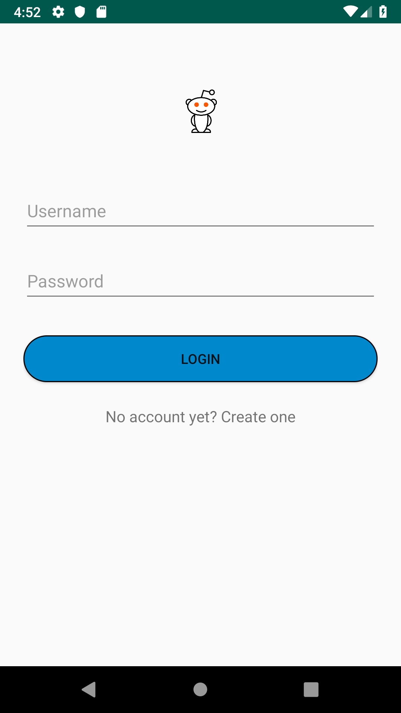
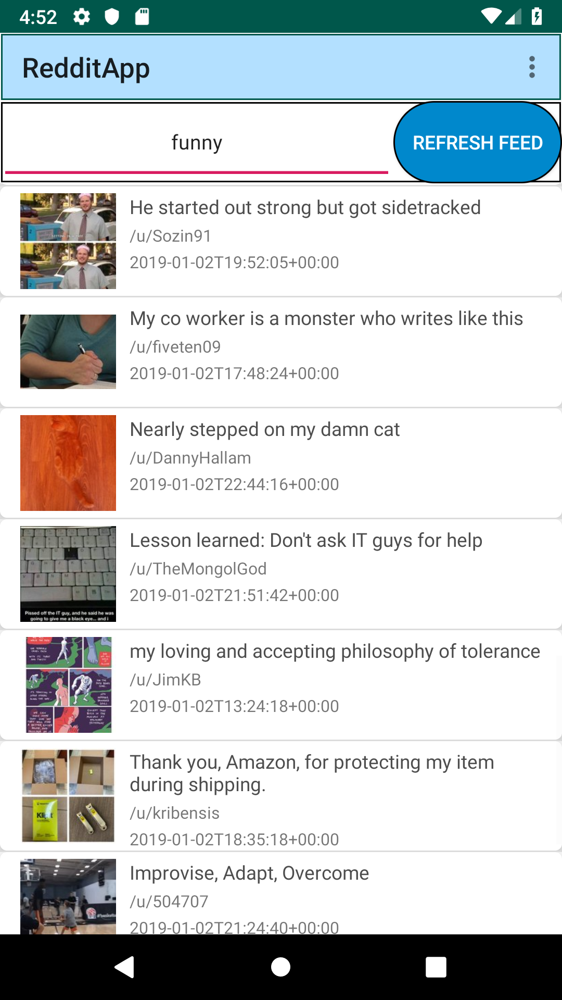

An Android app that integrates with Reddit.com's open source API.
---

</img>
&nbsp;&nbsp;&nbsp;&nbsp;&nbsp;&nbsp;&nbsp;&nbsp;
</img>

Some of the things this app does:

1. Parse XML/JSON using the Retrofit library to extract information from and post information on the website.
2. GET/POST requests with Retrofit
3. Logging into a Reddit Account using session parameters.
4. Viewing contents from Reddit like comments, posts and various subreddits.
5. Use of multiple types of views (CardViews, Webviews), toolbars, menus etc.
---
